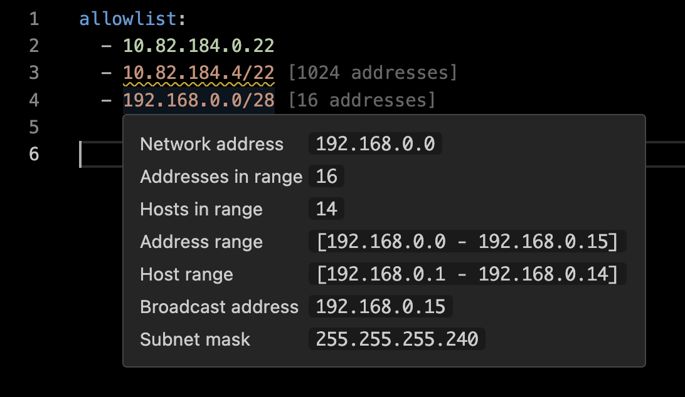

# cidr-ip-range README

## Features

Shows annotations for IPV4 cidr ranges with the number of addresses in the range.

Tooltip provides more detailed information on hover.



Uses the [cidr-regex](https://www.npmjs.com/package/cidr-regex) and [ip](https://www.npmjs.com/package/ip) libraries to find ipv4 cidr ranges in open documents and display information about them.

## Options

### Toggle codelens

There is a codelens action to copy the information to the clipboard, which can be enabled by adding the following to your settings.json

```json
{
  "cidr-ip-range.enableCodeLens": true,
  "cidr-ip-range.codeLensFormat": "json"
},
```

### Change codelens copy format

You can alternatively copy the data as it appears in the table by changing the `codeLensFormat` to "table"

```json
{
  "cidr-ip-range.enableCodeLens": true,
  "cidr-ip-range.codeLensFormat": "table"
},
```

### Toggle inline decorator

You can enable or disable the inline decorator which shows how many IP addresses are in a range

```json
{
  "cidr-ip-range.enableDecorator": false,
},
```

Full list of configuration options

```json
{
  "cidr-ip-range.enableCodeLens": {
    "type": "boolean",
    "description": "Enables a CodeLens with an action to copy the cidr range information to the clipboard",
    "default": false
  },
  "cidr-ip-range.enableDecorator": {
    "type": "boolean",
    "description": "Enables the inline decorator that shows how many IP addresses are in a range",
    "default": true
  },
  "cidr-ip-range.codeLensFormat": {
    "type": "string",
    "enum": [
      "json",
      "table"
    ],
    "default": "json",
    "description": "Sets which format the cidr range information will be copied as"
  }
}
```

## Still to do

Support IPV6

## Release Notes

### 0.0.1

Initial release of cidr-ip-range

### 0.0.4

Added codelens ability to copy data to clipboard, suggested by Thomas Schlesinger

### 0.0.5

Added copy to clipboard format types (json / table)

### 0.0.6

Added configuration option to toggle the inline decoration

[Issue #1](https://github.com/lukepearson/vscode-extension-cidr-ip-range/issues/1) - Reported by Jake Ginnivan

### 0.0.7

Fixed configuration options defaults and removed typo in copy to table
